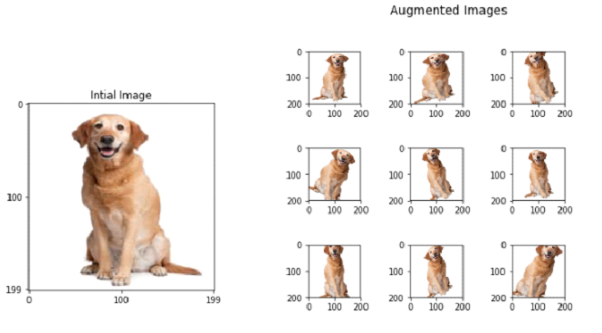

# Nodeflux Internship Project

## Daftar Isi
- Requirements
- Latar Belakang
    - Image Similarity
    - Text Similarity
- Benchmarking
    - Image Similarity
    - Text Similarity
- Image Augmentation
    - Cara menggunakan
    - Hasil Augmentasi Gambar

-----------

## Requirements
- OpenCV               : 3.4.2
- Python Image Library : 5.3.0
- Imagehash            : 4.0
- Matplotlib           : 3.0.1
- Seaborn              : 0.9.0

-----------

## Latar Belakang
### Image Similarity
Image similarity merupakan suatu proses untuk pencocokan gambar dengan menggunakan suatu algoritma tertentu. Image similarity dapat digunakan dalam kehidupan sehari-hari seperti yang diilustrasikan gambar dibawah ini :


Pada gambar diatas dapat dilihat bahwa terdapat sebuah mobil parkiran dan mobil yang sama keluar parkiran. Saat mobil masuk ke dalam parkiran. Maka plat nomor dideteksi dan disimpan di dalam database. Setelah itu, saat mobil tersebut keluar, maka plat nomor mobil juga akan dideteksi lagi dan dibandingkan menggunakan sebuah algoritma dengan semua plat nomor yang berada di dalam database. Algoritma tersebut harus bisa membuat keputusan bahwa plat nomor mobil tersebut yang keluar dan plat nomor mobil tersebut yang masuk merupakan suatu hal yang sama walaupun terdapat beberapa sedikit perbedaan.

### Text Similarity
Text similarity merupakan suatu proses untuk pencocokan teks dengan menggunakan suatu algoritma tertentu. Text similarity juga dapat digunakan seperti kasus diatas tetapi hanya membandingkan teks yang berada di plat nomor kendaraan bermotor seperti yang diilustrasikan gambar dibawah ini :


-----------

## Benchmarking
### Image Similarity
Dalam proyek ini, untuk algoritma **image similarity** yang digunakan untuk mencocokkan suatu gambar adalah :
- Hashing Images
- SIFT *(Scale-Invariant Feature Transform)*
- SURF *(Speed Up Robust Features)*

Performa pada algoritma tersebut telah diuji dengan hasil :
|               	| Akurasi    	| Durasi pencocokan antara 2 gambar 	|
|---------------	|------------	|-----------------------------------	|
| Hashing Image 	|  53.3333 % 	|                        0.001039 detik |
| SIFT          	| 100.0000 % 	|                        0.012375 detik |
| SURF          	|  86.6667 % 	|                        0.003389 detik |

### Benchmarking Text Similarity
Dalam proyek ini, untuk algoritma **text similarity** yang digunakan untuk mencocokkan suatu teks adalah :
- Levensthein Distance
- Sequence Matcher Similarity

Performa pada algoritma tersebut telah diuji dengan hasil :
|               	| Akurasi    	| Speed (Duration)	|
|---------------	|------------	|----------------------------------- |
| Levensthein Distance 	|  86.1111 % 	|           Fast (0.0629836 sec) |
| Sequence Matcher Similarity  | 97.2222 % 	|  Very Fast (0.0037645 sec) |

-----------------

## Image Augmentation
Augmentasi gambar merupakan suatu proses untuk memperbanyak suatu jumlah gambar dengan cara memodifikasi atau mengubah orientasi gambar tanpa mengubah makna dari gambar tersebut. 

Misalkan terdapat sebuah gambar mobil, apabila gambar tersebut diputar, maka gambar tersebut tetap dapat dianalisis oleh manusia sebagai label mobil, tetapi belum tentu dapat dianalisis oleh komputer sebagai label mobil. Hal tersebut terjadi karena komputer memproses data berdasarkan piksel per piksel.

Maka dari itu, agar komputer dapat memiliki kemampuan analisis yang hampir sama seperti manusia, maka segala kemungkinan orientasi gambar harus ditambahkan sebagai dataset. Sehingga apabila data yang diaugmentasi berasal  dari data yang memiliki jenis label terkecil, maka data tersebut menjadi semakin banyak dan dapat mengimbangi jumlah data jenis label lainnya, dan augmentasi menjadi solusi yang tepat untuk masalah imbalance dataset.

Berikut ini merupakan ilustrasi dari image augmentation.



### Cara Penggunaan
Code untuk mengaugmentasi gambar terdapat di dalam folder `1.Image_Augmentation/Image_Augmentation_bbox` berdasarkan lokasi dari `README.MD` ini dan dapat digunakan dengan cara mengetikkan :
```
from Image_Augmentation_bbox import augmented_image_class

final_class = augmented_image_class(image, dict_bbox)
final_dict = final_class.get_result()

final_dict['scale']['small']['images']
final_dict['scale']['small']['bbox_char']
```
Berikut ini merupakan ilustrasi dari cara menggunakannya
- **Input gambar**

- **Output gambar**


### Hasil Image Augmentation
Berikut ini merupakan hasil keseluruhan parameter dari augmentasi gambar dengan menggunakan cara diatas.
**Gambar Asli**

**Gambar Augmentasi**


